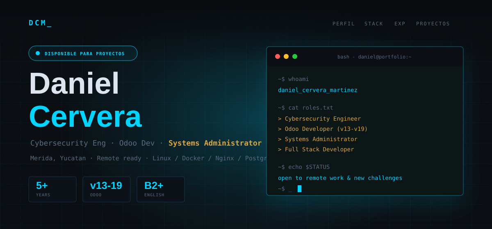

<div align="center">
  
</div>

<div align="center">

  <a href="https://github.com/Daniel-Cervera">
    
  </a>
  <a href="https://github.com/Daniel-Cervera?tab=followers">
    
  </a>
  <a href="https://daniel-cervera.github.io/Daniel-Cervera/">
    
  </a>

</div>

<div align="center">

  <a href="https://github.com/Daniel-Cervera">
    
  </a>

</div>

<br />

> Disponible para proyectos remotos, colaboraciones open source y retos que combinen **Cybersecurity**, backend robusto, Odoo e infraestructura Linux.

```bash
~$ whoami
daniel_cervera_martinez

~$ cat roles.txt
> Cybersecurity Engineer
> Odoo Developer  (v13-v19)
> Systems Administrator
> Full Stack Developer

~$ uname -a
Linux ubuntu 22.04 LTS | Docker | Nginx | PostgreSQL

~$ echo $STATUS
open to remote work & new challenges
```

## // 01 - Perfil

Soy un **profesional en tecnología** con más de **5 años de experiencia** implementando sistemas ERP, administrando infraestructura y desarrollando soluciones full stack. Mi especialidad es **Odoo**, desde la versión 13 hasta la 19, combinando implementación funcional, módulos personalizados con Python y reportes QWeb.

Mi trayectoria ha evolucionado desde **implementador especializado** hasta **administrador de sistemas** y **desarrollador full stack**. Trabajo cómodo en entornos que mezclan **Linux, Docker, Nginx, PostgreSQL, seguridad, automatización y despliegues en producción**.

Actualmente exploro desarrollo con **Next.js e IA aplicada** a soluciones empresariales. Estoy basado en **Mérida, Yucatán**, con experiencia en equipos remotos y presenciales.

<table>
  <tr>
    <td align="center" width="25%"><strong>5+</strong><br /><sub>años de experiencia</sub></td>
    <td align="center" width="25%"><strong>v13-v19</strong><br /><sub>Odoo dominado</sub></td>
    <td align="center" width="25%"><strong>4</strong><br /><sub>empresas y roles progresivos</sub></td>
    <td align="center" width="25%"><strong>B2+</strong><br /><sub>inglés técnico</sub></td>
  </tr>
</table>

## // 02 - Tech Stack

<div align="center">

  **Languages**

  
  
  
  
  

  **ERP & Frameworks**

  
  
  
  

  **Infra & DevOps**

  
  
  
  
  

  **Database & Tools**

  
  
  
  
  

</div>

## // 03 - GitHub Stats

<div align="center">

  
  

</div>

<div align="center">

  

</div>

<div align="center">

  

</div>

<div align="center">

  

</div>

## // 04 - Experiencia

| Fecha | Rol / Empresa | Enfoque |
| --- | --- | --- |
| Oct 2025 - Dic 2025 | **Desarrollador / Implementador** · Elemetic | Soluciones Odoo, Python, Linux y entornos de producción. |
| Abr 2025 - Ago 2025 | **Desarrollador Full Stack** · Matadryve | ERP con IA y AR, backend/frontend, bases de datos y trabajo ágil. |
| Nov 2024 - Mar 2025 | **Implementador de Odoo** · Waykna | Facturación, POS, inventarios, contabilidad, migraciones y PostgreSQL. |
| Jun 2022 - Sep 2024 | **Administrador de Sistemas · Dev Junior** · OGUM Consultoría en TI y RH | Instancias Odoo en producción, Nginx, SSL, Docker, Linux Ubuntu y PostgreSQL. |
| May 2020 - Jun 2022 | **Implementador de Odoo** · OGUM Consultoría en TI y RH | Configuración funcional, migración de información y soporte a usuarios finales. |

## // 05 - Proyectos

<table>
  <tr>
    <td width="50%" valign="top">
      <h3>Server Management Module - Odoo 17</h3>
      <p>Módulo open source integrado en Odoo 17 para administración de servidores: verificación de conexiones, monitoreo de servicios como Nginx y Odoo, y visualización de commits de GitHub.</p>
      <p>
        
        
        
      </p>
      <a href="https://github.com/Daniel-Cervera">→ Ver en GitHub</a>
    </td>
    <td width="50%" valign="top">
      <h3>Videojuego Indie 2D</h3>
      <p>Videojuego 2D desarrollado en Python como recurso de aprendizaje y práctica para la comunidad de desarrolladores. Proyecto abierto, iterativo y orientado a compartir conocimiento.</p>
      <p>
        
        
        
      </p>
      <a href="https://github.com/Daniel-Cervera">→ Ver en GitHub</a>
    </td>
  </tr>
</table>

## // 06 - Contacto

<div align="center">

  <a href="mailto:daniel.cervera.2029@gmail.com">
    
  </a>
  <a href="https://github.com/Daniel-Cervera">
    
  </a>
  <a href="tel:+529381242205">
    
  </a>

</div>

<div align="center">
  <sub>Crafted with care · Mérida, Yucatán · <code>~$ exit 0</code></sub>
</div>
